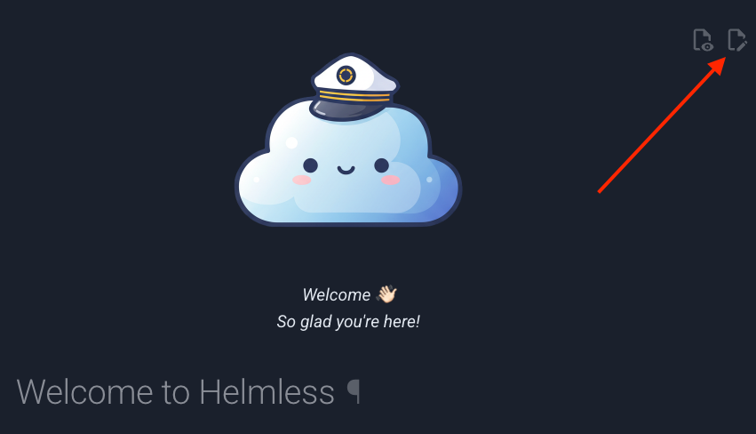

# 📜 Contributing to the Helmless Documentation

So cool of you to want to contribute to the Helmless documentation! 🤗

This guide will help you get started to make larger changes to the documentation and preview them locally.

If you only want to make a small change to a single page, you can click the edit button at the top of the page. That will save you the hassle of setting up your local development environment.



## 📦 Docs Development Environment

The documentation site is built with [MkDocs Material](https://squidfunk.github.io/mkdocs-material/).

To setup the development environment, install [Python](https://www.python.org/) using asdf and the following dependencies:

```sh
asdf plugin add python
asdf plugin add pre-commit
```

Then install the tools and dependencies:

```sh
asdf install
```

After that install the pre-commit hooks:

```sh
pre-commit install
```

Then install the Python dependencies:

```sh
pip install -r docs/requirements.txt
```

To run the documentation site locally, run:

```sh
mkdocs serve
```

## 📝 Documentation Structure

All primary documentation is located in the `docs/docs/` folder and written in [Markdown](https://www.markdownguide.org/) with additional suggar using [Material for MkDocs](https://squidfunk.github.io/mkdocs-material/).

The Chart schemas are written in [JSON Schema](https://json-schema.org/) and are co-located with the Helm charts. There is a [custom plugin](docs/_hooks/schema_renderer.py) that renders the schemas with nice formatting.

The `mkdocs.yml` file is the configuration for the documentation site. It includes the plugins, theme, and other settings.

The most important part of the `mkdocs.yml` file is the [`nav` section](./mkdocs.yml#L19). This section defines the sidebar navigation for the documentation.

## 📝 Writing Documentation

Create a new file in the `docs/docs/` folder or one of the subfolders and add it to the `nav` section in the `mkdocs.yml` file. Make sure to link it in other files that should reference it. All links should be relative to the location of the file you are writing.

## 📝 Documentation Guidelines

- All new pages should be added to the `nav` section in the `mkdocs.yml` file.
- All links should be relative to the location of the file you are writing.
- All images should be added to the `docs/assets/images/` folder.

## ❓ Questions?

If you have any questions, please reach out to us on the [Discussion Forum](https://github.com/helmless/helmless/discussions).
