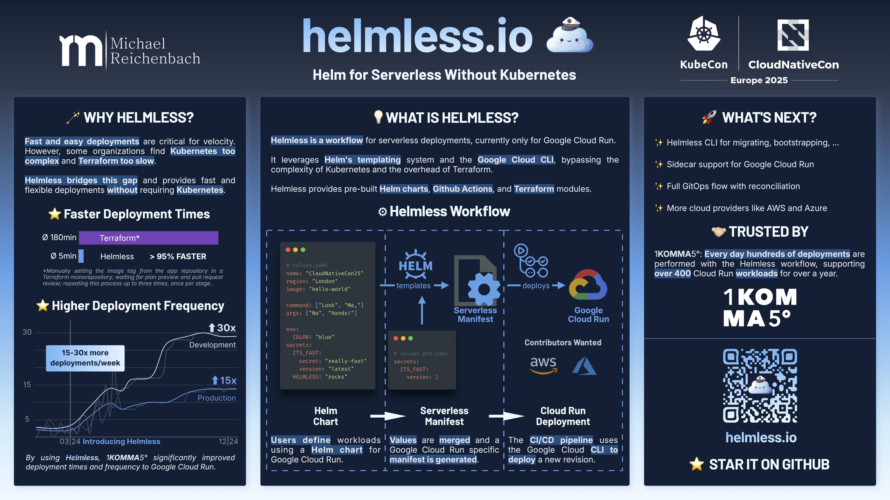

## 💡 What is Helmless?

Helmless is a workflow for serverless deployments to Google Cloud Run.

It leverages Helm's templating system and the `gcloud` CLI to deploy Cloud Run jobs and services, bypassing the complexity of Kubernetes and the overhead of Terraform.

The Helmless project provides pre-built Helm charts, Github Actions, and Terraform modules.

Helmless was first presented at [KubeCon Europe 2025](https://kccnceu2025.sched.com/event/b4c79f12ddc46cd74bd39a159cd7f08f). Here is the poster:

## 🏃‍♂️ Quick Start

Visit [helmless.io](https://helmless.io) for the docs, or jump right in:

1. [Why use Helmless?](https://helmless.io/why-helmless)
2. [Helmless Architecture](https://helmless.io/docs/architecture/)
3. [5min Quickstart](https://helmless.io/docs/cloudrun/quickstart)

## 🏗️ Repositories

To help organize the Helmless project, we have grouped the repositories by prefixing them with the cloud provider, e.g. `google-cloudrun-*`.

### 🪴 Core Repositories

- **[helmless](https://github.com/helmless/helmless)** - The Helmless homepage and documentation
- **[template-action](https://github.com/helmless/template-action)** - Basic GitHub Action for templating Helm charts, merging values on the fly

### 🚀 Google Cloud Run Repositories

- **[google-cloudrun-action](https://github.com/helmless/google-cloudrun-action)** - Deployment action for Google Cloud Run wrapping the `gcloud` CLI and [template-action](https://github.com/helmless/template-action)
- **[google-cloudrun-charts](https://github.com/helmless/google-cloudrun-charts)** - Helm charts for Google Cloud Run Jobs and Services
- **[google-cloudrun-service-terraform-module](https://github.com/helmless/google-cloudrun-service-terraform-module)** - Supporting Terraform module for creating a Helmless Google Cloud Run Service
- **[google-workload-identity-federation-terraform-module](https://github.com/helmless/google-workload-identity-federation-terraform-module)** - Supporting Terraform module for setting up GitHub Actions to deploy to Google Cloud Run using Workload Identity Federation

### 🗃️ Miscellaneous Repositories

- **[gcp-infrastructure](https://github.com/helmless/gcp-infrastructure)** - The GCP infrastructure for the Helmless project to setup the CI/CD end-to-end testing pipelines

## 🤝 Contributing

You want to contribute to Helmless? Great ❤️!

Check out our [Contributing Guide](https://helmless.io/contributing) on the website or the [CONTRIBUTING.md](CONTRIBUTING.md) files in the relevant repository to get started.

## 📝 License

This project is licensed under the MIT License - see the [LICENSE](LICENSE) file for details.

---

⭐ If you find Helmless useful, please consider giving it a star! It helps the project grow and improve.
