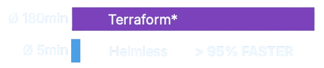
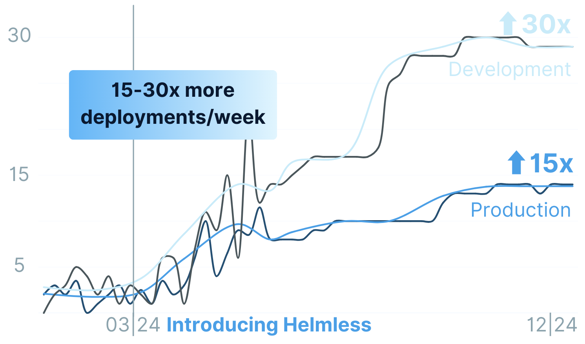

# Why Helmless?

Fast and easy deployments are critical for velocity. However, some organizations find Kubernetes too complex and Terraform too slow.

Helmless bridges this gap and provides fast and flexible deployments without requiring Kubernetes.

## 🚀 Faster Deployment Times

By switching to Helmless, you can reduce the time it takes to deploy your containers to Google Cloud Run from hours to minutes. Terraform is not built for fast iterations and continuous delivery. That however is exactly what you need for the deployment of your containers.

Helmless bypasses Terraform and directly integrates with your app repository. It uses Helm to render the Google Cloud Run manifest and then directly deploys it using the `gcloud` CLI.

<figure markdown="span">
  
  <figcaption style="font-size: 0.8em;">*Manually setting the image tag from the app repository in a Terraform monorepository; waiting for plan preview and pull request review; repeating this process up to three times, once per stage.</figcaption>
</figure>

## ⭐ Higher Deployment Frequency

Helmless allows you to deploy your containers to Google Cloud Run at any time, without waiting for the long approval and preview process of infrastructure changes done in Terraform. It can be directly integrated into your CI/CD pipeline and unlocks the full potential of continuous delivery.

<figure markdown="span">
  { width="75%" }
  <figcaption>By using Helmless, <strong>1KOMMA5°</strong> significantly improved deployment times and frequency to Google Cloud Run.</figcaption>
</figure>

## :material-rocket: Getting Started

-   :material-book-open-page-variant:{ .lg .middle } __What is Helmless?__

    ---

    Learn what Helmless is, how it works and why it's different from other tools.

    [:octicons-arrow-right-24: Learn more](./docs/index.md)

-   :material-cog-outline:{ .lg .middle } __Helmless Architecture__

    ---

    Understand the architecture, technical details behind Helmless, and how to extended it to other platforms.

    [:octicons-arrow-right-24: Understand the Architecture](./docs/helmless/architecture.md)

-   :material-rocket-launch:{ .lg .middle } __Deploy Your First Service__

    ---

    Get hands-on experience and deploy your first service to Google Cloud Run with Helmless

    [:octicons-arrow-right-24: Get Started](./docs/cloudrun/quickstart.md)

-   :material-code-braces:{ .lg .middle } __Examples__

    ---

    Explore real-world examples and sample configurations, including a complete CI/CD pipeline.

    [:octicons-arrow-right-24: View Examples](./docs/cloudrun/examples.md)

## :material-terraform: Why **not** use Terraform?

Terraform is a great tool for managing infrastructure as code, but especially for frequent deployments it can quickly become a bottleneck. Infrastructure changes should be carefully managed and gated, and not be a part of the fast feedback loop that developers expect for deploying their own code as an application container.

With the increasing size of the stack, the plan and apply times of Terraform can quickly become a bottleneck.

But we also recognize that you still need to somehow link the application container to the underlying infrastructure. This is why we created the [helmless/google-cloudrun-service-terraform-module](https://github.com/helmless/google-cloudrun-service-terraform-module) that creates a [Terraform shell for your application container](./docs/cloudrun/terraform.md), which you can then use in your Terraform code to link the application container to the underlying infrastructure.

## :material-kubernetes: Why **not** use Kubernetes?

Every team and organization is different, and so are their infrastructure and application requirements. Kubernetes is a great tool for managing containerized applications, but it's not the only tool for the job. And often times you don't need the full power of Kubernetes. But in the end, it's up to you to decide what's best for your team and organization.

Helmless just offers a different path to deploy your application containers, without the need to have a Kubernetes cluster or use Terraform.

## :simple-helm: Why use Helm?

Helm is a great tool for managing containerized applications, and its templating feature offers a great developer experience. It allows you to define your application container specification in a very simple YAML file and gives the platform teams an easy way to add abstractions and customizations on top of it, making container-based deployments a breeze.

However by default Helm is built for Kubernetes, which brings a lot of overhead and complexity for container-based deployments, where often times you don't need the full power of Kubernetes. And small teams and organizations often don't have the resources to maintain a production-grade Kubernetes cluster.

Helmless aims to give you the developer experience of Helm, without the overhead of Kubernetes. It does this by only using Helm's templating feature, linting and schema validation and not the full Helm CLI.
